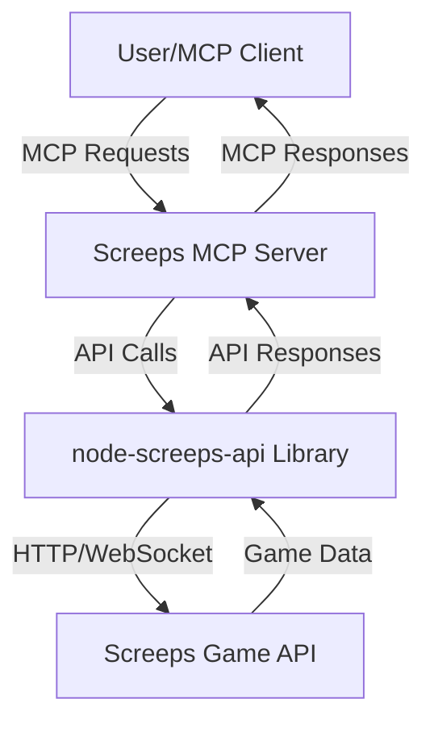

# Screeps MCP Server Architecture

This document describes the architecture of the Screeps MCP Server.

## Overview

The Screeps MCP Server is a Node.js application built with TypeScript that utilizes the `node-screeps-api` library to communicate with the Screeps game API. It exposes a set of tools and resources compliant with the Model Context Protocol (MCP), allowing users to interact with their Screeps account and game data.

## Components

1.  **MCP Server Core**:
    *   Built using the MCP SDK.
    *   Handles incoming MCP requests for tools and resources.
    *   Manages authentication and session handling with the Screeps API.
    *   Routes requests to the appropriate service modules.
    *   Formats responses according to MCP specifications.

2.  **`node-screeps-api` Wrapper**:
    *   A dedicated module that encapsulates all interactions with the `node-screeps-api` library.
    *   Provides a simplified and consistent interface for the service modules to access Screeps API functionality.
    *   Handles API-specific error mapping and rate limiting logic.

3.  **Service Modules**:
    *   Organized by functionality (e.g., `RoomService`, `MarketService`, `MemoryService`).
    *   Each module implements the logic for a specific set of MCP tools and resources.
    *   Interacts with the `node-screeps-api` Wrapper to fetch or send data to the Screeps API.

4.  **Configuration Module**:
    *   Manages server configuration, including API credentials, server settings (official, private, Steam), and logging levels.
    *   Loads configuration from environment variables or a configuration file.

5.  **Logging Module**:
    *   Provides comprehensive logging for requests, responses, errors, and important events.
    *   Configurable log levels and output destinations.

## Data Flow

1.  An MCP client (e.g., a user interface or another script) sends a request to the Screeps MCP Server (e.g., to use a tool like `getRoomDetails`).
2.  The MCP Server Core receives the request, authenticates it if necessary, and identifies the target tool or resource.
3.  The request is routed to the relevant Service Module (e.g., `RoomService`).
4.  The Service Module uses the `node-screeps-api` Wrapper to make the necessary calls to the Screeps Game API.
5.  The `node-screeps-api` library handles the actual HTTP/WebSocket communication with the Screeps API.
6.  The Screeps API returns the requested data.
7.  The `node-screeps-api` Wrapper processes the API response and returns it to the Service Module.
8.  The Service Module transforms the data into the format expected by the MCP tool/resource.
9.  The MCP Server Core sends the formatted response back to the MCP client.

## Key Design Principles

*   **Modularity**: Components are designed to be loosely coupled and independently testable.
*   **Scalability**: While initial focus is on single-user interaction, the architecture should allow for future enhancements if needed.
*   **Extensibility**: Easy to add new tools, resources, and service modules.
*   **Error Handling**: Robust error handling at all layers, providing meaningful error messages to the user.
*   **Security**: Secure handling of API credentials and user data.
*   **Testability**: Code is written with testability in mind, with unit and integration tests for all major components.

---

Next, I will create the `docs/authentication.md` file.
